# PIC32CXBZ2_WBZ45x Zigbee E-Paper Home Thermostat


> "IOT Made Easy!" 

Devices: **| PIC32CXBZ2 | WBZ45x |**<br>
Features: **| ZIGBEE | E-PAPER | TOUCH |**


## ⚠ Disclaimer

<p><span style="color:red"><b>
THE SOFTWARE ARE PROVIDED "AS IS" AND GIVE A PATH FOR SELF-SUPPORT AND SELF-MAINTENANCE. This repository contains example code intended to help accelerate client product development. </br>

For additional Microchip repos, see: <a href="https://github.com/Microchip-MPLAB-Harmony" target="_blank">https://github.com/Microchip-MPLAB-Harmony</a>

Checkout the <a href="https://microchipsupport.force.com/s/" target="_blank">Technical support portal</a> to access our knowledge base, community forums or submit support ticket requests.
</span></p></b>

## Contents

1. [Introduction](#step1)
1. [Bill of materials](#step2)
1. [Hardware Setup](#step3)
1. [Software Setup](#step4)
1. [Harmony MCC Configuration](#step5) 
1. [Board Programming](#step6)
1. [Run the demo](#step7)
1. [Related Applications](#step8)

## 1. Introduction<a name="step1">

This example application enables us to develop a home thermostat device. This application requires a Zigbee Coordinator, Thermostat router and a sensor end-device. Alexa Echo or [Combined Interface](https://github.com/MicrochipTech/PIC32CXBZ2_WBZ45x_ZIGBEE_CI_OLED_Display) can be used as the Coordinator device. The Thermostat router uses an E-Paper Bundle 2 Display and an external touch interface ( ATtiny3217 Xplained Pro and T10 Xplained Pro kit ) with the WBZ451 Curiosity board to create a Zigbee Thermostat application. The touch interface enables us to set the temperature and Reset the device to factory new. The set temperature will be reported to the devices in the Zigbee network. The set temperature and the Zigbee console logs are shown on the E-PAPER display. The [Multisensor](https://github.com/MicrochipTech/PIC32CXBZ2_WBZ45x_ZIGBEE_MULTISENSOR_TEMPHUM13_CLICK) device reports the current temperature to the device in the Zigbee network. Based on the set temperature and current temperature the AC is switched ON or switched OFF.

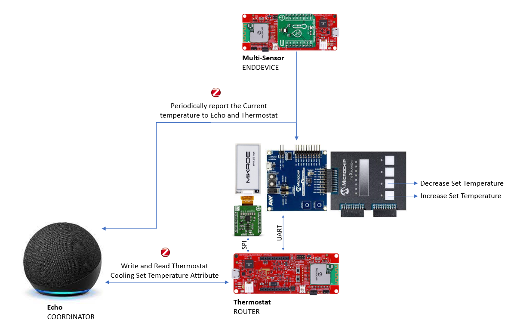

| Tip | Go through the [overview](https://onlineDocs.microchip.com/pr/GUID-A5330D3A-9F51-4A26-B71D-8503A493DF9C-en-US-2/index.html?GUID-668A6CB2-F1FB-438D-9E1E-D67AC3C1C132) for understanding few key Zigbee 3.0 protocol concepts |
| :- | :- |

## 2. Bill of materials<a name="step2">

| TOOLS | QUANTITY |
| :- | :- |
| [PIC32CX-BZ2 and WBZ451 Curiosity Development Board](https://www.microchip.com/en-us/development-tool/EV96B94A) | 1 |
| [E-Paper Bundle 2](https://www.mikroe.com/e-paper-bundle-2) | 1 |
| [ATtiny3217 Xplained Pro](https://www.microchip.com/en-us/development-tool/ATTINY3217-XPRO) | 1 |
| [T10 Xplained Pro Extension Kit](https://www.microchip.com/en-us/development-tool/AC47H23A) | 1 |

## 3. Hardware Setup<a name="step3">

- Connect the E-Paper Bundle 2 with the WBZ451 CURIOSITY BOARD using the below table.

|WBZ451|E-PAPER |Description |WBZ451|E-PAPER|Description|
| :- | :- | :- | :- |:- | :- |
|AN|15(BSY)|BUSY|PWM|16(D/C)|Data/Command|
|RST|2(RST)|RESET|INT|NC|NC|
|CS|3(CS)|CHIP SELECT|RX|NC|NC|
|SCK|4(SCK)|SPI CLOCK|TX|NC|NC|
|MISO|NC|NC|SCL|NC|NC|
|MOSI|6(MOSI)|SERIAL DATA INPUT|SDA|NC|NC|
|3.3V|7(3.3V)|POWER SUPPLY|5V|NC|NC|
|GND|8(GND)|GROUND|GND|9(GND)|GROUND|

| Note: PIN 15 (BSY) of E-PAPER should be connected with AN of WBZ451 !! |
| --- |

- Connect T10 Extension header 3 (EXT3) to ATtiny3217 Xplained Pro  Extension Header 1 (EXT1).
- Connect the External 3 header of ATtiny3217 Xplained Pro touch interface with the WBZ451 Curiosity board using jumper wires as shown in the table below.

|ATtiny3217 Xplained Pro+T10 Xplained Pro|Description|WBZ451 |Description|
| :- | :- | :- | :- |
|PB3|UART-RX|PA13(SDA)|Sercom2-UART-TX|
|PB2|UART-TX|PA14(SCL)|Sercom2-UART-RX|
|5.0V IN|Power supply|5V|Power supply|
|GND|Ground|GND|Ground|

| Note: Make sure to have common GND! |
| --- |

 

## 4. Software Setup<a name="step4">

- [MPLAB X IDE ](https://www.microchip.com/en-us/tools-resources/develop/mplab-x-ide#tabs)

    - Version: 6.05
	- XC32 Compiler v4.10
	- MPLAB® Code Configurator v5.1.17
	- PIC32CX-BZ_DFP v1.0.107
	- MCC Harmony
	  - csp version: v3.14.0
	  - core version: v3.11.1
	  - CMSIS-FreeRTOS: v10.4.6
	  - wireless_pic32cxbz_wbz: v1.1.0
	  - wireless_ble: v1.0.0	  
	  - dev_packs: v3.14.0
	  - wolfssl version: v4.7.0
	  - crypto version: v3.7.6
	  - wireless_zigbee version: v5.0.0
	    
- Any Serial Terminal application like [TERA TERM](https://download.cnet.com/Tera-Term/3000-2094_4-75766675.html) terminal application

- [MPLAB X IPE v6.05](https://microchipdeveloper.com/ipe:installation)

## 5. Harmony MCC Configuration<a name="step5">

### Getting started with Thermostat application with WBZ451 CURIOSITY BOARD.

| Tip | New users of MPLAB Code Configurator are recommended to go through the [overview](https://onlineDocs.microchip.com/pr/GUID-1F7007B8-9A46-4D03-AEED-650357BA760D-en-US-6/index.html?GUID-AFAB9227-B10C-4FAE-9785-98474664B50A) |
| :- | :- |

**Step 1** - Connect the WBZ451 CURIOSITY BOARD to the device/system using a micro-USB cable.

**Step 2** - The project graph of the application is shown below.

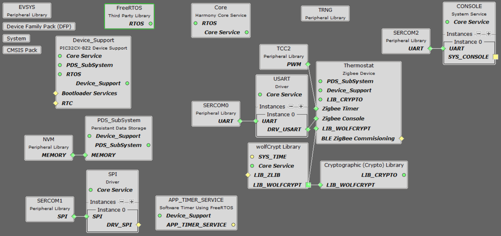

- From Device resources, go to wireless->drivers->zigbee->Device types and select THERMOSTAT. Accept Dependencies or satisfiers, select "Yes". Add UART components needed for console logs and commands. Right click on the "⬦" in Zigbee console and add the satisfier and in the same way add SERCOM0 to the USART console as shown below.

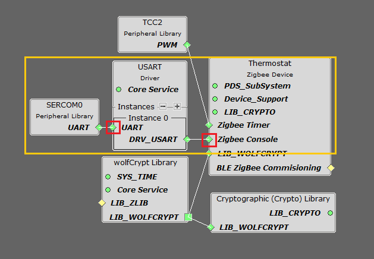

- The SERCOM0 UART configuration is depicted as follows.

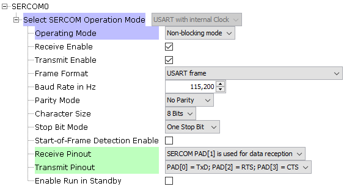

- Select Wolfcrypt library and make sure that "Support random number generation" box is unchecked as shown below.

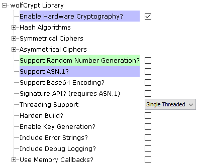

- From Device resources, go to System services and select console. Right click on the "⬦" on the instance0 and select SERCOM2 to create a UART communication with the touch interface and the configurations are shown below.

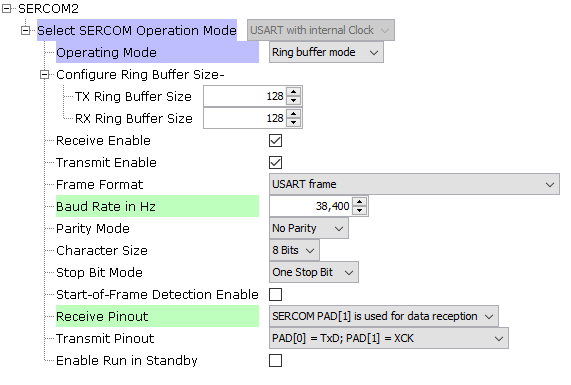

- From Device resources, go to Harmony->Peripherals->SERCOM and selct SERCOM1. Right click on the "⬦" on SPI and select SPI Driver. Accept Dependencies or satisfiers, select "Yes". The SERCOM1 configuration is depicted as follows.

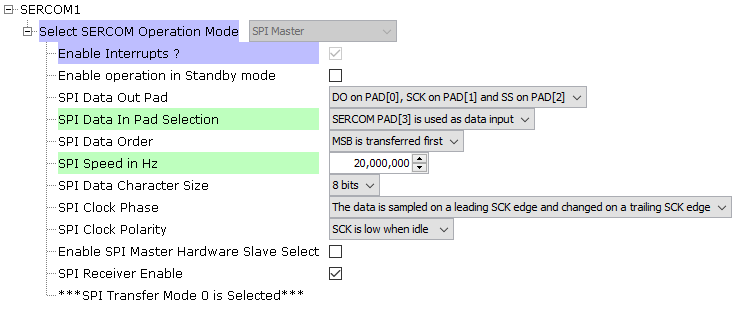

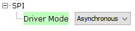

- From Device resources, go to Wireless->System services and select "APP_TIMER_SERVICE".

- The SYSTEM configuration is depicted as follows.

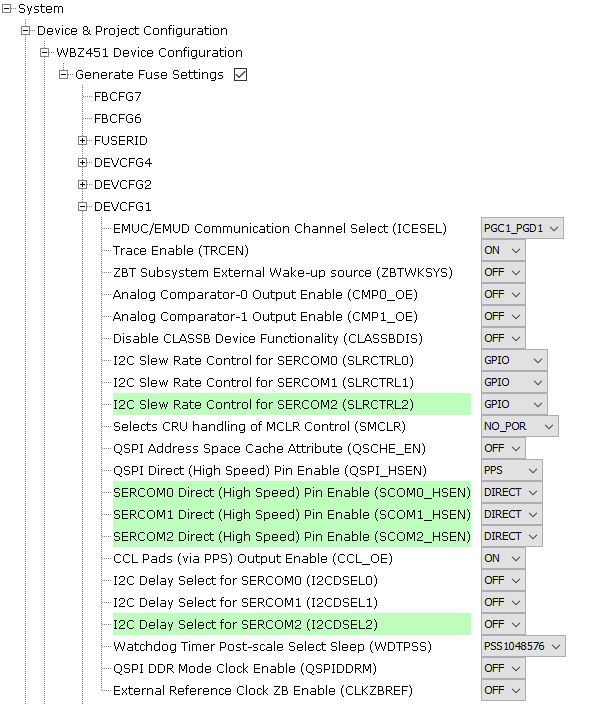

- From project graph, go to Plugins->PIN configuration and configure as follows.

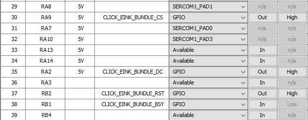

**Step 4** - [Generate](https://onlineDocs.microchip.com/pr/GUID-A5330D3A-9F51-4A26-B71D-8503A493DF9C-en-US-1/index.html?GUID-9C28F407-4879-4174-9963-2CF34161398E) the code.

- After the code gets generated a Merge window will appear. Click on the arrow and merge all the files.

**Step 5** - From the unzipped folder copy the folder click_routines(which contains the eink_bundle.h, eink_bundle_font.h, eink_bundle_image.h, eink_bundle.c,  eink_bundle_font.c, eink_bundle_image.c) to the folder firmware/src under your MPLAB Harmony v3 application project and add the Header (eink_bundle.h, eink_bundle_font.h, eink_bundle_image.h) and Source file (eink_bundle.c, eink_bundle_font.c, eink_bundle_image.c).

- In the project explorer, Right click on folder Header Files and add a sub folder click_routines by selecting “Add Existing Items from Folders…”


- Click on “Add Folder…” button.


- Select the “click_routines” folder and select “Files of Types” as Header Files.

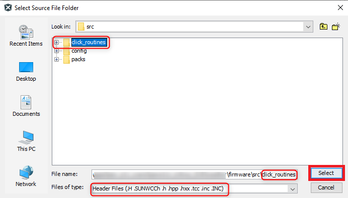

- Click on “Add” button to add the selected folder.


- The eink bundle header files gets added to your project.

- In the project explorer, Right click on folder Source Files and add a sub folder click_routines by selecting “Add Existing Items from Folders…”.


- Click on “Add Folder…” button


- Select the “click_routines” folder and select “Files of Types” as Source Files.


- Click on “Add” button to add the selected folder


- The eink bundle source files gets added to your project.
- The click_routines folder contain an C source file eink_bundle.c. You could use eink_bundle.c as a reference to add E-Paper display functionality to your application.

**Step 6** - In "app_user_edits.c", make sure the below code line is commented 

- "#error User action required - manually edit files as described here".

- Go to source files->config->default->zigbee->z3device->thermostat->thThermostatUiConfCluster.c and comment line 90.

```
LCD_PRINT(0,10,"Temp = %d deg C",thThermostatClusterServerAttributes.localTemperature.value);
```

- Go to header files->config->default->zigbee->z3device->common->include->z3Device.h, add the following code in the Includes section 

```
#include "click_routines/eink_bundle/eink_bundle.h"
#include "click_routines/eink_bundle/eink_bundle_image.h"
#include "click_routines/eink_bundle/eink_bundle_font.h"
```
- In "z3Device.h", replace the code in line 89 and 90 with the below code.

```
  #define LCD_INIT()                                  e_paper_initialize()
  #define LCD_PRINT(...)                              e_paper_print(__VA_ARGS__)
```

**Step 7** - Replace the app.c, app_zigbee_handler.c, thThermostatCluster.c and app.h file.

| Note | This application repository should be cloned/downloaded to perform the following steps. |
| :- | :- |
| Path | The application folder can be foung in the following [link](https://github.com/MicrochipTech/PIC32CXBZ2_WBZ45x_WINC1500_Zigbee_Wi-Fi_Smart_Thermostat/tree/main/Thermostat_Zigbee_Panel/../firmware) |

- Copy the "app.c" and "app.h" files by navigating to the following path: "../firmware/src/"
- Paste the files under source files in your project folder (...\firmware\src).
- Copy the "app_zigbee_handler.c" and "app_timer.c" files by navigating to the following paths: 
	- "../firmware/src/app_zigbee"
	- "../firmware/src/app_timer"
- Paste the files under the respecive folders in your project folder .
- Copy the "thThermostatCluster.c" file by navigating to the following path: "../firmware/src/config/default/zigbee/z3device/thermostat"
- Paste the files under the respecive folders in your project folder .

**Step 8** - Clean and build the project. To run the project, select "Make and program device" button.

**Step 9** - The data is printed onto the tera term and E-Paper display.

- Baud rate: 115200
- Com port: COM USB serial port

#### Programming the ATTINY3217 XPRO with the T10 interface

- Follow the steps provided under [program the precompiled hex file](https://microchipdeveloper.com/ipe:programming-device)  section to program the ATtiny3217 Xplained Pro and T10 Xplained Pro interface.
- The application hex file can be found by navigating to the following path: 
	- "PIC32CXBZ2_WBZ45x_WINC1500_Zigbee_Wi-Fi_Smart_Thermostat/Thermostat_Zigbee_Panel/Hex/ATTiny3217_T10.hex"
- The touch buttons are configured as follows.
	- Button1: To increase the set temperature
	- Button2: To decrease the set temperature
	- To reset the device to factory new press Button 1, 3 and 4 simultaneously for 3 seconds.
	
### Programming the ZigBee Coordinator Device

- The Zigbee coordinator application is available in this [link](https://github.com/MicrochipTech/PIC32CXBZ2_WBZ45x_ZIGBEE_CI_OLED_Display). Follow the steps provided to program the Combined interface application.

| Note | This application can be used to create the centralized network. |
| :- | :- |

### Programming the ZigBee End Device

- The Zigbee end-device application is available in this [link](https://github.com/MicrochipTech/PIC32CXBZ2_WBZ45x_ZIGBEE_MULTISENSOR_TEMPHUM13_CLICK). Follow the steps provided to program the Multisensor application.

## 6. Board Programming<a name="step6">

## Programming hex file:

### Program the precompiled hex file using MPLAB X IPE

- The Precompiled hex file is given in the hex folder.
Follow the steps provided in the link to [program the precompiled hex file](https://microchipdeveloper.com/ipe:programming-device) using MPLABX IPE to program the pre-compiled hex image. 

### Build and program the application using MPLAB X IDE

The application folder can be found by navigating to the following path: 

- "WBZ451_E_PAPER_Zigbee_Thermostat\firmware\WBZ451_E_PAPER_ZIGBEE_THERMOSTAT.X"

Follow the steps provided in the link to [Build and program the application](https://github.com/Microchip-MPLAB-Harmony/wireless_apps_pic32cxbz2_wbz45/tree/master/apps/ble/advanced_applications/ble_sensor#build-and-program-the-application-guid-3d55fb8a-5995-439d-bcd6-deae7e8e78ad-section).

## 7. Run the demo<a name="step7">

- After programming the board, the expected application behavior is shown in the below [video](https://github.com/MicrochipTech/PIC32CXBZ2_WBZ45x_BLE_UART_OLED_Display/blob/main/Docs/Working_Demo.gif). In this application the router reports the set temperature value to a [coordinator device](https://github.com/MicrochipTech/PIC32CXBZ2_WBZ45x_ZIGBEE_CI_OLED_Display).


- The Combined Interface application can also be used instead of Alexa to create the ZigBee network.

## 8. Related applications<a name="step8">

- [ZigBee Applications](https://github.com/Microchip-MPLAB-Harmony/wireless_apps_pic32cxbz2_wbz45/tree/master/apps/zigbee)
- [Smart Industrial Thermostat](https://github.com/MicrochipTech/PIC32CXBZ2_WBZ45x_WINC1500_Zigbee_Wi-Fi_Smart_Thermostat)


